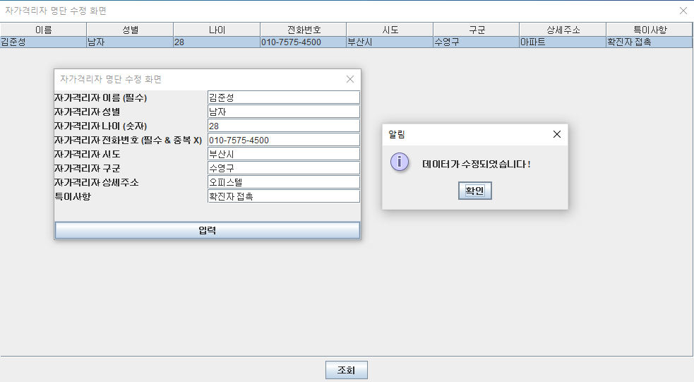

# Swing 프로젝트

## 프로젝트
- 코로나 위기 대응 관리 시스템
- Coronavirus Crisis Management System; CorManSys
- Java Swing API를 이용하여 GUI 응용 프로그램 제작

## 제작기간
2021-01-31 ~ 2021-02-03

## 제작환경
- SDK: Oracle JDK 1.8 // Java
- IDE: Eclipse 2019-06
- DBMS Client: SQL Developer
- DBMS Server: Oracle Database 18c Express Edition

## 실행화면

